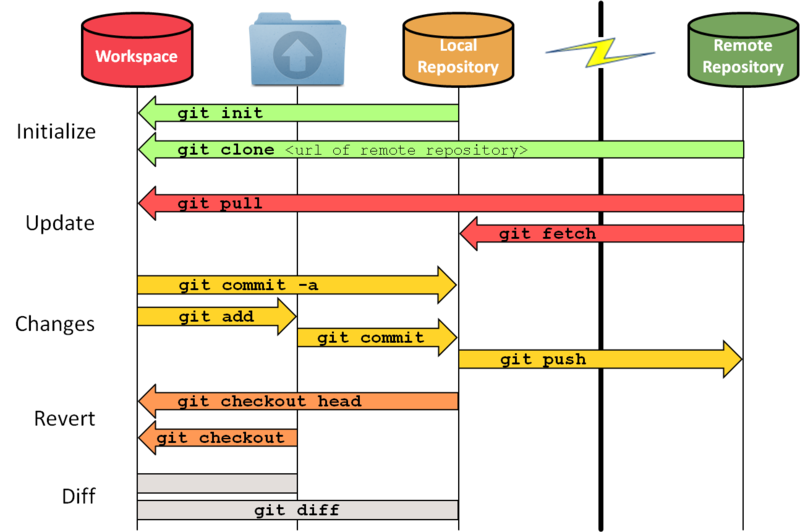

# Git und wichtige Befehle

- - -

## Was ist Git?
 Git ist Software zur Versionsverwaltung von Dateien/Programmen.\
 Es hilft dir also, deine Fortschritte Online zu teilen und Feedback
 zu empfangen.\
 Man kann einfach seinen Zugriff mit anderen (z.B anderen Kollegen) teilen
 und so zusammen arbeiten und Lösungen finden.\
 [Hier](https://github.com/bitcoin/bitcoin) ist zum Beispiel das Github repo von Bitcoin.

- - -

## Wie benutze ich Git (Befehle)?
 
### "Getting Started"
- git config --global user.name (name)
  - Setzt Nutzernamen
- git config --global user.email (mail)
  - Setzt Email
- git config --global --list
  - Lass dir beides anzeigen
- git clone (SSH)
  - Den SSH Key findet man auf der Internetseite beim Repository.\
  Jetzt kann man am Projekt arbeiten.

- - -

### Git benutzen

- git status
  - Mit diesem Befehl siehst du alle Dateien,
  die sich seit dem letzten Commit verändert haben.
- git add .
  - Mit "git add" allgemein fügt man Dateien zum "Index" hinzu.
  Das bedeutet hier, dass die Dateien einer Liste hinzugefügt werden,
  die beim nächsten Commit dabei sind. "git add ." fügt einfach alle Dateien
  aus dem repository hinzu, die nicht ignoriert sind.
- git commit -m "changelog"
  - Mit " git commit -m (changelog) " fügst du jetzt die zuvor hinzugefügten Dateien
  deinem lokalen Repository hinzu.\
  Dabei gibt man immer eine Art "Changelog" an, in der steht, was sich verändert hat.
- git push
  - Wenn man die Dateien jetzt final hochladen möchte, benutzt man "git push".
- git log
  - Zeit History von vergangenen Commits
- git rm -> remove
- git mv -> move

- - -

### git fetch, git merge und git pull
Diese drei Befehle sind dazu da, um Änderungen aus dem remote Repo mit
deinem lokalem Repo zu synchronisieren.\
Also wie ein git push, nur anders herum.
- git fetch
  - Mit "git fetch" ziehst du dir erstmal die Dateien runter,
  aber du ersetzt noch keine Dateien. Sozusagen nur zum angucken.
- git merge
  - Fetched Dateien kann man dann in sein Workspace integrieren
- git pull
  - "git pull" macht einfach beides gleichzeitig

- - -
Einfache Visualisierung, wie die Commands auf den Workspace und
den lokalem/remote repository wirkt:\

