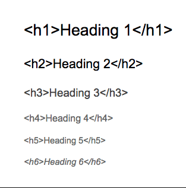

# HTML - Hypertext Markup Language

- - -

## Was ist HTML?

HTML (Hypertext Markup Language) ist eine textbasierte Auszeichnungssprache.\
Ihre Dokumente (.html Dateien) sind die Grundlage des World Wide Webs
und werden von unseren Webbrowsern decodiert und dargestellt.

- - -

## HTML Basics

### HTML Layout

#### Head

Der **[Head](https://www.w3schools.com/html/html_head.asp)**
in HTML ist ein Container der Elemente enthält,
die oft von Browsern benutzt werden.

-     <head> </head>
    - Öffnet und schließt den Head-Container

**Elemente:**

###### title

-     <title> Titel </title>
    - Fügt der Seite einen **Titel** hinzu, der von Browsern z.B
      im Tab oder für Favoriten benutzt wird

###### style

-     <style> p {color:red] </style>
    - Wird benutzt um im **Head** selber Style-Informationen zu integrieren

###### link

-     <link rel="stylesheet" href="style.css">
    - ```<link>``` wird am meißten benutzt, um **Stylesheets** oder **Favicons** extern einzubinden

###### meta

-     <meta charset="UTF-8">
    - ```<meta>``` wird benutzt um Metadaten wie
      Autor, Beschreibung, Charset und Viewport

###### script
```html
-     <script> 
            function myFunction() {
                     document.getElementById("demo").innerHTML = "Hello JavaScript!";
                     }
      </script>
    - Mit ```<script></script>``` kann man **Skripts** von **Javascript** integrieren
```
#### Body

```<body></body>``` ist der Main-Container der Seite und enthält
somit den gesamten Content
Hier ist der **Body** dieser [index.html](../index.html) als Beispiel:\
\


### Text Structure

Es gibt ein paar nützliche Tools um Text und Boxen besser zu Strukturieren
und damit auch übersichtlicher zu machen:

#### Basisstrukur

###### p

-     <p color=red> Dies ist ein Paragraph </p>
    - ```<p></p>``` wird benutzt um eine Zeile an Text zu gruppieren und ggf.
      letztendlich entweder **Inline** oder mit **CSS** zu gestalten.

###### div

-     <div class="box">  </div>
    - ```<div></div>``` teilt ein Dokument in Sektionen oder Divisionen in Blöcke ein, um z.B
      eine Box zu erschaffen, in der bestimmter Content steht.
      Mit **CSS** kann man dann auf die Klasse (in dem Beispiel) .box zugreifen
      und auch die Box als gesamtes gestalten.

###### span

-     <span style="background-color:lightblue"> Text! </span>
    - ```<span></span>``` ist eigentlich genau wie ```<div></div>```, nur dass es nicht
      **block** ist sondern **inline**. Es teilt also keine Sektionen in blöcke, sondern
      in Abschnitte in z.B Texten ein, die dann mit **CSS** oder **JavaScript** angezapft werden können.

###### br

-     Dies<br>ist<br>ein<br>Text
    - ```<br>``` (break row) wird benutzt,
      um die Zeile zu brechen und damit ein **newline** zu generieren:\
      

###### b

-     <b>mit dem b tag mache ich Text fett</b>
    - **mit ```<b>text</b>``` mache ich Text fett**.

###### q

-     <q>Quotationmarks</q>
    - Text, der mit ```<q></q>``` eingebettet wird, wird in <q>Quotationmarks</q> eingehüllt.

#### Lists

###### ol
```html
-     <ol>
        <li> Schritt</li>
        <li> Schritt</li>
        <li> Schritt</li>
      </ol>
```
So sieht es dann im Browser aus:\
<ol>
    <li> Schritt</li>
    <li> Schritt</li>
    <li> Schritt</li>
</ol>

Der Inhalt der Liste wird nummeriert, also sortiert.\
Das eignet sich zum Beispiel für Schritte von Rezepte oder Anleitungen.

###### ul
```html
-       <ul>
          <li> Aufzählung</li>
          <li> Aufzählung</li>
          <li> Aufzählung</li>
        </ul>
```
So sieht es dann im Browser aus:<br>
<ul>
    <li> Aufzählung</li>
    <li> Aufzählung</li>
    <li> Aufzählung</li>
</ul>

Der Inhalt wird unsortiert einfach mit Punkten aufgezählt.
Das eignet sich zum Beispiel für die Zutatenliste eines Rezepts.


- - -

## HTML Tags

Die Tags in HTML sind dazu da, den Content auf die Seite zu kriegen,
und CSS um diesen zu gestalten.

#### Links

-     <a href="https://www.planeo.de">Planeo Hyperlink!</a>

Hyperlinks werden mit ```<a href="URL">Name</a>``` verlinkt.\
Als value für das Attribut **href** gibt man dann z.B eine Webadresse an.\
<a href="https://www.planeo.de">Planeo.de Hyperlink!</a>\
Wenn man zwischen Websiten navigiert muss man aber die volle Webadresse benutzen.
(https://www.*)

#### Comments

-     <!-- Dies wäre ein Kommentar -->

**Kommentare** können benutzt werden um Code zu strukturieren und um
z.B Mitarbeiter aufzuklären was da im Code eigentlich steht und
wofür es da ist.\
Kommentare werden nicht als HTML Code interpretiert und somit nicht
aufgefangen.

#### Headings

-     <h1>Überschrift</h1>

Mit den tags ```<h[1-6]></h[1-6]>``` definiert man Überschriften von verschiedenen
Größen, wobei ```<h1></h1>``` das größte und ```<h6></h6>``` das kleinste ist:\
\


### Multimedia

#### Images, Videos and Audio

###### img

-     
    - Mit dem tag **img** kann man Bilder einbetten.\
      Mit `````` gibt man den Pfad an, und mit\
      `````` gibt man eine Art Backup-Text
      an, falls das Bild nicht lädt.

###### video

-     <video controls><source src="video.mp4" type="video/mp4"></video>
    - Mit ```<video></video>``` gibt man den Pfad des Videos mit\
      ```<source src="video.mp4 type="video/mp4">``` im **video** Container.\
      Das Attribut ```<video controls>``` aktiviert die Kontrolle über den Video-Player (so wie play, pause und volume)

###### audio

-     <audio controls><source src="audio.mp3" type="audio/mpeg"></audio>
    - Mit ```<audio></audio>``` gibt man den Pfad der Audio mit\
      ```<source src="audio.mp3 type="audio/mpeg">``` im **audio** Container.\
      Das Attribut ```<audio controls>``` aktiviert die Kontrolle über den Audio-Player (so wie play, pause und volume)

#### Favicon

Ein Favicon ist das kleine Bild links bei den Browser-Tabs:\
\
\
\
Man verlinkt sie mit ```<link rel="icon" type="image/x-icon" href="favicon.ico">``` im Head:

Auf Seiten wie https://www.favicon.cc/ kann man kostenlos eigene Favicons pixeln.

- - -

## HTML Forms

```<form></form>``` ist dazu da, um Webformulare zu erstellen und Benutzerdaten
einzusammeln.\
Diese Daten werden dann oft an einen Server geschickt
um sie zu verarbeiten.

###### input

-     <form> <input type="text"> </form>

In den Container kommt dann eines der meißtbenutzten Attribute, ```<input type="">```.\
Mit dem [input type](https://www.w3schools.com/html/html_form_input_types.asp)
kann man dann die Art des Inputs angeben, standardmäßig **text**.

###### Label
```html
-      <form>
         <label for="test">Testtext</label><br>
         <input type="text" id="test" name="test">
       </form>
```
- Mit ```<label for="">...</label>``` kann man sozusagen dem **input** eine Überschrift geben und so
      ihren Nutzen erklären.\
      Dafür muss man beim Label dann die id des inputs angeben.<br><br>
      So sieht das dann im Browser aus:<br><br>
      <form>
         <label for="test">Testtext</label><br>
         <input type="text" id="test" name="test">
      </form>

###### Submit
```html
-     <form>
         <label for="test">Testtext</label><br>
         <input type="text" id="test" name="test">
         <input type="submit">
      </form>
```
- Mit ```<input type="submit">``` kann man einen Submit button hinzufügen,
      um das Formular abzuschicken:<br><br>
      So sieht es dann im Browser aus:<br><br>
      <form>
         <label for="test">Testtext</label><br>
         <input type="text" id="test" name="test">
         <input type="submit">
      </form>

###### form action
```html
-     <form action="test.php">
         <label for="test">Testtext</label><br>
         <input type="text" id="test" name="test">
         <input type="submit">
      </form>
```
- Aber wohin wird das Formular dann geschickt?\
      Das spezifiziert man dann mit ```<form action="test.php">```.\
      Man kann das Formular z.B an ein PHP-Dokument schicken,
      um es dort verarbeiten zu lassen.

###### post & get
```html
-     <form action="test.php" method="get">
         <label for="test">Testtext</label><br>
         <input type="text" id="test" name="test">
         <input type="submit">
      </form>
```
Es gibt zwei Methoden, wie das Formular abgeschickt wird.\
Standardmäßig ist das ```<form action="" method="get">```.\
Diese Methode ist gut dafür,
falls man die Formularergebnisse z.B bookmarken möchte.\
Wenn man allerdings sensible Informationen über das Formular abschickt, z.B
Passwörter, dann sollte man niemals **get**, sondern ```<form action="" method="post">``` benutzen,
da bei der Methode **post**, die Daten nicht, anders wie bei **get**,
in der URL angezeigt werden, sondern in der HTTP Anfrage selbst.\
Dazu kommt das 3000 character limit bei **get**, welches es bei **post** nicht gibt.

###### textarea
```html
-     <form>
        <label for="test">Testtext</label><br>
        <textarea id="test" rows="4" cols="30">Das ist ein 4 Reihen Textfeld</textarea><br>
        <input type="submit">
      </form>
```
- Mit dem Element ```<textarea></textarea>``` kann man ein Textfeld mit vorgegebener
      Basis-größe erschaffen.<br><br>
      So sieht es dann im Browser aus:<br><br>
      <form>
        <label for="test">Testtext</label><br>
        <textarea id="test" rows="4" cols="30">Das ist ein 4 Reihen Textfeld</textarea><br>
        <input type="submit">
      </form>

###### select
```html
-     <form>
         <label for="test">Lieblingsobst</label><br>
         <select id="test">
            <option value="Apfel">Apfel</option>
            <option value="Birne">Birne</option>
            <option value="Orange">Orange</option>
         </select>
         <input type="submit">
      </form>
```
- Mit dem ```<select></select>``` Element kann man statisches dropdown-menü erstellen,
      bei dem nur die vorgegebenen optionen verfügbar sind:<br>
      -So sieht es dann im Browser aus:<br><br>
      <form>
         <label for="test">Lieblingsobst</label><br>
         <select id="test">
            <option value="Apfel">Apfel</option>
            <option value="Birne">Birne</option>
            <option value="Orange">Orange</option>
         </select>
         <input type="submit">
      </form>

###### button

-     <button>dieser button macht nix</button>
    - Mit dem ```<button></button>``` Element kann man einen button hinzufügen.
      Dem kann man auch z.B mit dem Attribut ```<button onclick="">``` ein Event zuweisen.
    - <button>dieser button macht nix</button>

###### fieldset & legend
```html
-     <form>
        <fieldset>
        <legend>Fragen</legend>
        <label for="test">Lieblingsobst</label><br>
        <select id="test">
            <option value="Apfel">Apfel</option>
            <option value="Birne">Birne</option>
            <option value="Orange">Orange</option>
        </select>
        <input type="submit">
        </fieldset>
      </form>
```
Mit dem Element ```<fieldset></fieldset>``` kann man ein Ramen um Teile des Formulars machen,
um sie besser zu strukturieren.\
Mit ```<legend></legend>``` gibt man diesen Feldern dann eine "Überschrift":

<form>
    <fieldset>
        <legend>Fragen</legend>
        <label for="test">Lieblingsobst</label><br>
        <select id="test">
            <option value="Apfel">Apfel</option>
            <option value="Birne">Birne</option>
            <option value="Orange">Orange</option>
        </select>
        <input type="submit">
    </fieldset>
</form>

###### radio
```html
-     <form action="test.php">
        <fieldset>
            <legend>Lieblingsauto?</legend>
            <input type="radio" id="y" name="fav_car" value="mercedes">
            <label for="y">Mercedes</label><br>
            <input type="radio" id="n" name="fav_car" value="bmw">
            <label for="n">BMW</label><br>
            <input type="radio" id="n" name="fav_car" value="VW">
            <label for="n">VW</label><br>
            <input type="submit">
        </fieldset>

      </form>
```
Mit dem **input-type** ```<input type="radio">``` kann man Gruppen von
Auswahl bilden, von der man aber immer nur eine Option auswählen kann.

<form>
    <fieldset>
        <legend>Lieblingsauto?</legend>
        <input type="radio" id="y" name="fav_car" value="mercedes">
        <label for="y">Mercedes</label><br>
        <input type="radio" id="n" name="fav_car" value="bmw">
        <label for="n">BMW</label><br>
        <input type="radio" id="n" name="fav_car" value="VW">
        <label for="n">VW</label><br>
        <input type="submit">
    </fieldset>
</form>

###### file
```html
-     <form action="test.php" method="post">
        <fieldset>
         <legend>Anhang</legend>
         <label for="sfile">Select one file: </label>
         <input type="file" id="sfile" name="anhang"> <br> <br>
         <input type="submit">
        </fieldset>
      </form>
```
Mit dem **input-type** ```<input type="file">``` kann man die möglichkeit geben,
eine Datei hochzuladen. Um zu erlauben, dass mehrere Dateien hochgeladen werden,
kann man dem Element ```<input>``` das Attribut ```multiple``` geben.\
Bei Datei-Uploads muss die **form-method** ```<form method="post">``` sein!

<form method="post">
    <fieldset>
     <legend>Anhang</legend>
     <label for="sfile">Select one file: </label>
     <input type="file" id="sfile" name="anhang"> <br> <br>
     <input type="submit">
    </fieldset>
</form>

###### hidden
```html
-     <form>
        <fieldset>
         <legend>Hidden Input!</legend>
         <label for="test">Test Text</label>
         <input type="text" id="test" name="Text">
         <input type="hidden" id="hvalue" name="hvalue" value="123">
         <input type="submit">
        </fieldset>
      </form>
```
Mit einem **hidden-input** kann man ein **value** zu einem Formular hinzufügen,
dass der Nutzer nicht einfach sehen und bearbeiten kann.\
Mit developer tools und inspect element kann man diesen input trotzdem bearbeiten.\
Es ist also nicht sicher!

###### checkbox
```html
-     <form>
        <fieldset>
         <legend>Zutaten Pizza</legend>
         <input type="checkbox" id="ingredient1" name="ingredient" value="pepperoni">
         <label for="ingredient1">Pepperoni</label> <br>
         <input type="checkbox" id="ingredient2" name="ingredient" value="zwiebel">
         <label for="ingredient2">Zwiebel</label> <br>
         <input type="checkbox" id="ingredient3" name="ingredient" value="doenerfleisch">
         <label for="ingredient3">Doenerfleisch</label> <br>
         <input type="checkbox" id="ingredient4" name="ingredient" value="schinken">
         <label for="ingredient4">Schinken</label> <br> <br>
         <input type="submit">
        </fieldset>
      </form>
```
Mit dem **checkbox-input** kann man eine Gruppe von Optionen erstellen,
von der man so viele wie man will, oder auch garkeine Option auswählen kann.

<form>
    <fieldset>
     <legend>Zutaten Pizza</legend>
     <input type="checkbox" id="ingredient1" name="ingredient" value="pepperoni">
     <label for="ingredient1">Pepperoni</label> <br>
     <input type="checkbox" id="ingredient2" name="ingredient" value="zwiebel">
     <label for="ingredient2">Zwiebel</label> <br>
     <input type="checkbox" id="ingredient3" name="ingredient" value="doenerfleisch">
     <label for="ingredient3">Doenerfleisch</label> <br>
     <input type="checkbox" id="ingredient4" name="ingredient" value="schinken">
     <label for="ingredient4">Schinken</label> <br> <br>
     <input type="submit">
    </fieldset>
</form>

- - -

## HTML Tables
```html
    <table>
       <caption>Überstunden</caption>
       <tr>
         <th>Montag</th>
         <th>Dienstag</th>
         <th>Mittwoch</th>
         <th>Donnerstag</th>
         <th>Freitag</th>
         <th>Samstag</th>
         <th>Sonntag</th>
       </tr>
       <tr style="text-align: center">
         <td>1</td>
         <td>2</td>
         <td>0</td>
         <td>0</td>
         <td>0</td>
         <td>2</td>
         <td>0</td>
       </tr>
      </table>
```
- Den Container öffnet man mit ```<table></table>```
- Eine neue table-row öffnet man mit ```<tr></tr>```
- Für Überschriften benutzt man table-heading ```<th></th>``` für Zellen
- Für normale Zellen benutzt man table-data ```<td></td>```
- Man kann der ganzen Tabelle mit ```<caption></caption>``` auch eine Überschrift geben

So sieht das dann im Browser aus:
<table>
   <caption>Überstunden</caption>
   <tr>
     <th>Montag</th>
     <th>Dienstag</th>
     <th>Mittwoch</th>
     <th>Donnerstag</th>
     <th>Freitag</th>
     <th>Samstag</th>
     <th>Sonntag</th>
   </tr>
   <tr style="text-align: center">
     <td>1</td>
     <td>2</td>
     <td>0</td>
     <td>0</td>
     <td>0</td>
     <td>2</td>
     <td>0</td>
   </tr>
</table>

### Colspan

Ein Colspan wird benutzt, um horizontale Zellen zu verbinden:
```html
    <table>
        <caption>Schüler Grundschule</caption>
        <tr>
          <th>Name</th>
          <th>Vorname</th>
          <th colspan="2">Telefonnummern Eltern</th>
        </tr>
        <tr>
          <td>Schmidt</td>
          <td>Finn</td>
          <td>1234567890</td>
          <td>0987654321</td>
        </tr>
        <tr>
          <td>Meier</td>
          <td>Alex</td>
          <td>1234567890</td>
          <td>0987654321</td>
        </tr>
    </table>
```
<table>
    <caption>Schüler Grundschule</caption>
    <tr>
      <th>Name</th>
      <th>Vorname</th>
      <th colspan="2">Telefonnummern Eltern</th>
    </tr>
    <tr>
      <td>Schmidt</td>
      <td>Finn</td>
      <td>1234567890</td>
      <td>0987654321</td>
    </tr>
    <tr>
      <td>Meier</td>
      <td>Alex</td>
      <td>1234567890</td>
      <td>0987654321</td>
    </tr>
</table>

### Rowspan

Ein Rowspan ist dazu da, um vertikale Zellen zu verbinden:
```html
    <table>
        <caption>Schüler Grundschule</caption>
        <tr>
          <th>Name</th>
          <td>Schmidt</td>
          <td>Meier</td>
        </tr>
        <tr>
          <th>Vorname</th>
          <td>Finn</td>
          <td>Alex</td>
        </tr>
        <tr>
          <th rowspan="2">Telefonnummern<br>Eltern</th>
          <td>1234567890</td>
          <td>1234567890</td>
        </tr>
        <tr>
          <td>0987654321</td>
          <td>0987654321</td>
        </tr>
    </table>
```
<table>
    <caption>Schüler Grundschule</caption>
    <tr>
      <th>Name</th>
      <td>Schmidt</td>
      <td>Meier</td>
    </tr>
    <tr>
      <th>Vorname</th>
      <td>Finn</td>
      <td>Alex</td>
    </tr>
    <tr>
      <th rowspan="2">Telefonnummern<br>Eltern</th>
      <td>1234567890</td>
      <td>1234567890</td>
    </tr>
    <tr>
      <td>0987654321</td>
      <td>0987654321</td>
    </tr>
</table>

- - -

## Miscellaneous HTML

### Classes & IDs

Klassen und IDs sind dazu da, um Gruppen von, oder einzele, Elemente
direkt ansprechen zu können, sei es z.B.
mit CSS-Design oder Scripts von JavaScript.

Der Unterschied von Classes und IDs ist, dass IDs einzigarting sein müssen,
und Classes zu so vielen Elementen benutzt werden können wie man will. <br>
So kann man zum Beispiel einen wiederkehrenden Button mit einer Klasse versehen,
und diese per CSS ansteuern, damit man ihn nur einmal designen muss. <br>
<br>Beispiele:<br>

- ```<button class="continuebutton">```
- ``` <div id="article"> ```

Ansteuern kann man sie dann in CSS so:

- Classes
    - Mit einem Punkt. Also nach dem Beispiel oben: ``` .continuebutton{} ```
- IDs
    - Mit einem #. Also nach dem Beispiel oben: ``` #article{} ```

### Iframe

Ein inline frame wird benutzt, um ein anderes Dokument in deine Seite einzubetten.

    <iframe src="../index.html" width="500px" height="500px" title="iframe"></iframe>

So kann man, in dem Beispiel, die index.html mit 500x500px in die Seite einbetten

### Responsive Web Design

Responsive Web Design bedeutet eine Website zu erstellen, die auf allen
Geräten und Monitoren gut aussieht.\
Die Seite muss sich also an verschiedene Breiten anpassen.<br><br>

#### How to make a responsive web page

###### responsive viewport

-     <meta name="viewport" content="width=device-width, initial-scale=1.0">
    - Mit diesen Attributen sagt man der Website, dass sie sich an die Breite
      des Gerätes anpassen soll

###### responsive images

-     
    - Wenn man die max-width von einem Bild auf 100% stellt, skaliert sie automatisch responsive.
      Aber nie höher als die Originalgröße.

###### responsive text

-     <h1 style="font-size:10vw">Responsive Text!</h1>

Man kann Text responsive machen, indem man die Textgröße in ```vw``` angibt.\
```vw``` bedeutet viewport.

###### Media Query

-     @media screen and (max-width: 800px) {
       sidebar {
        display:block;
        width: 100%;
       }
      }
    - Das macht, dass der sidebar container ab einer Breite von maximal 800px
      zum Block-element wird und sich somit über dem main content befindet
      und nicht mehr daneben.

