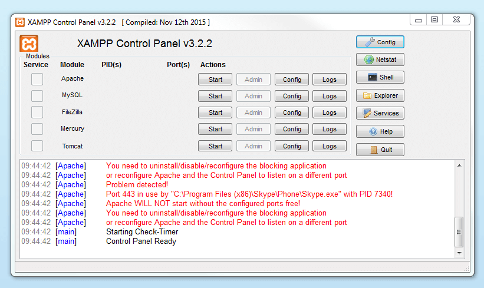

# XAMPP

- - -

## Was ist XAMPP

XAMPP ist ein Software-Paket, welches mit so ziemlich allen Dingen kommt
die man braucht, um mit einem Webserver durchzustarten.\
Es macht es sehr einfach, weil XAMPP direkt mit einem Apache Webserver,
MySQL, PHP und Perl kommt. (Deshalb X-AMPP (Abkürzungen der Software))\
Der Unterschied zu LAMP (meinem Setup) ist, dass es viel schneller und einfacher geht, weil
es ja schon alles installiert und miteinander verbindet.\
Zudem hat man alles sofort in einer GUI, was sehr Benutzerfreundlich ist.\
\
